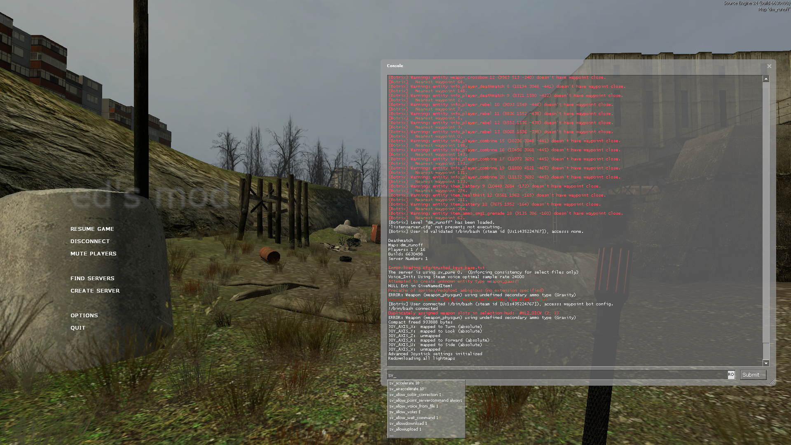
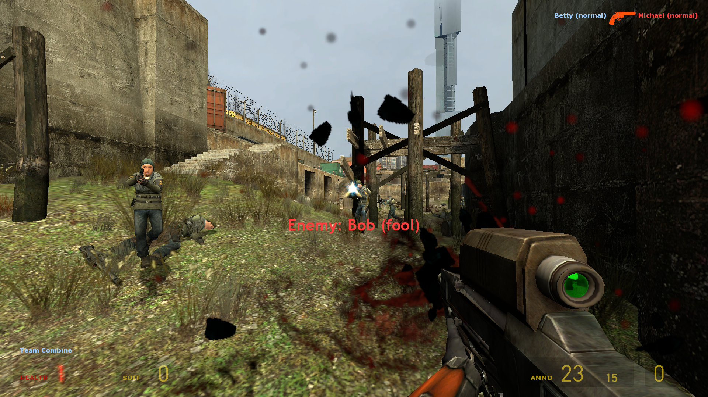
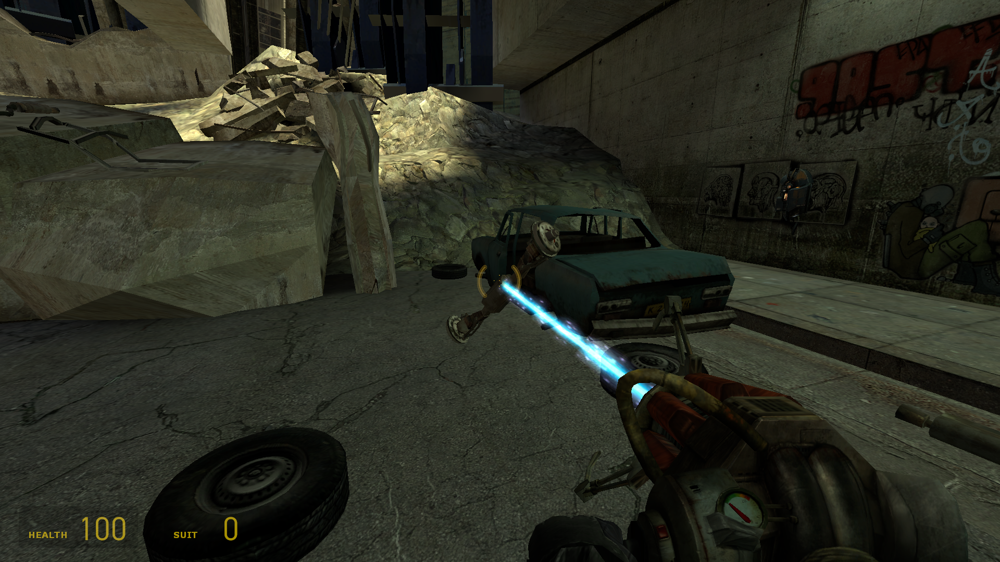
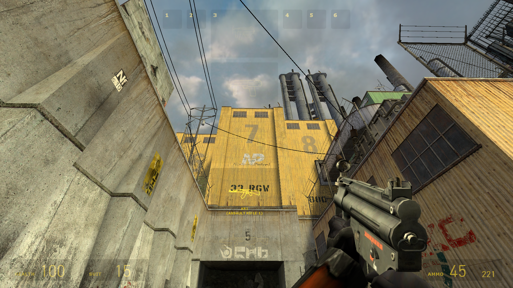
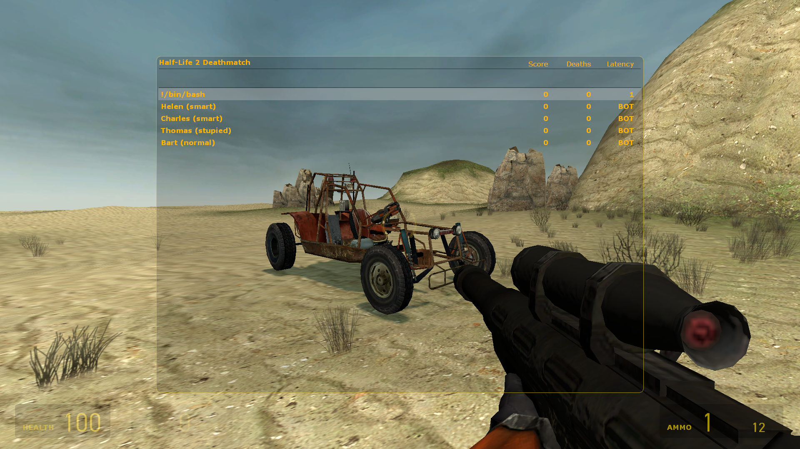

# About this repo
This is a mod for Half-Life 2: Deathmatch. It's based on the Source Engine 2013 SDK.

## Installation guide
To install this mod, simply copy the `mp/game/mod_hl2mp` to `Steam/SteamApps/sourcemods/`.

## Bots
This mod comes pre-installed with [Botrix](https://github.com/borzh/botrix). You can check out its repo using the link mentioned above. To add a bot, open your dev console and type:

`sv_cheats 1`

`botrix bot add`

## Screenshots

